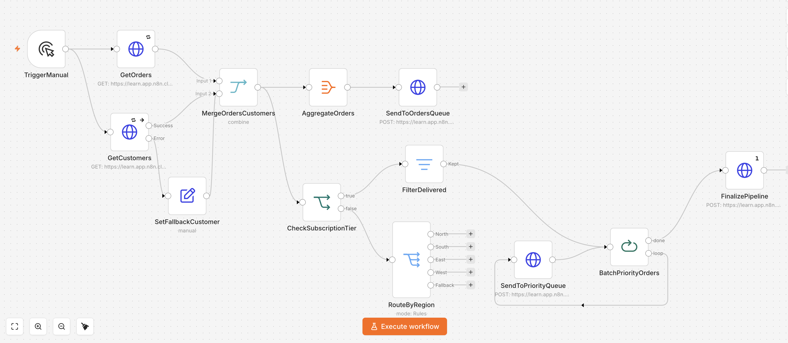

# n8n API Integration Pipeline

A portfolio workflow built in **n8n** that demonstrates a complete API integration pipeline with pagination, data enrichment, conditional routing, batch processing, retry logic, and error handling.

The project combines order data with customer data, routes records based on business rules, processes priority orders in controlled batches, and finalizes the workflow with a confirmation step.

## Workflow Overview

The workflow includes:

- Fetching paginated order data with **HTTP Request**
- Fetching customer data from a second API
- Combining orders and customers with **Merge**
- Aggregating enriched order data
- Filtering records based on order status
- Routing records by subscription tier with **IF**
- Routing non-enterprise records by region with **Switch**
- Sending enterprise orders to a priority queue
- Processing records in batches with **Loop Over Items**
- Retrying temporary API failures automatically
- Handling API errors with a fallback branch
- Finalizing the pipeline with a summary request

## Workflow Screenshots

### 1. Complete Workflow Overview

The complete n8n workflow combines API requests, pagination, data enrichment, conditional routing, batch processing, retry logic, and error handling.



### 2. Pagination Configuration

The Orders API uses pagination to retrieve all available records automatically.

The HTTP Request node updates the `page` query parameter for every request using:

```text
{{ $pageCount + 1 }}
```

Pagination stops when the API response is empty.

## 3. Retry Logic and Error Handling

The customer API request is configured with automatic retry logic:

- Maximum retries: 3
- Wait between retries: 1000 ms
- On Error: Continue using error output

If the API request still fails, the workflow can continue through the fallback branch instead of stopping completely.

## 4. Successful Pipeline Finalization

The final pipeline execution successfully verified:
- HTTP Request configuration
- Pagination handling
- Data merging
- Filtering
- Conditional routing
- Batch processing
- Error handling
- Retry logic


## Workflow Architecture

Main flow:

`Manual Trigger → Get Orders → Merge Orders & Customers → Aggregate Orders → Orders Queue`

Parallel customer enrichment:

`Manual Trigger → Get Customers → Merge Orders & Customers`

Priority processing:

`Merge Orders & Customers → Check Subscription Tier → Filter Delivered → Batch Priority Orders → Priority Queue → Loop`

Regional routing:

`Check Subscription Tier → Route By Region`

Error handling:

`Get Customers → Error Output → Set Fallback Customer → Merge Orders & Customers`

Finalization:

`Batch Priority Orders → Finalize Pipeline`

## Key n8n Concepts Demonstrated

- HTTP Request configuration
- API authentication with headers
- Pagination
- Merge by matching fields
- Aggregation
- Filtering
- Conditional routing
- Multi-path routing
- Batch processing
- Retry On Fail
- Error outputs
- Fallback data handling
- Expressions
- Workflow execution flow

## Workflow File

The exportable workflow is available here:

`api-integration-pipeline-public.json`

For security, account-specific credential references and assessment identifiers were removed from the public JSON.

When importing the workflow into n8n, configure your own credentials and replace placeholder values such as:

`YOUR_ASSESSMENT_ID`

## Importing into n8n

1. Download `api-integration-pipeline-public.json`.
2. Open n8n.
3. Create or open a workflow.
4. Choose **Import from File**.
5. Select the JSON file.
6. Configure your own API credentials.
7. Replace placeholder authentication values if required.
8. Review endpoint URLs before executing the workflow.

## Error Handling

The customer API branch includes two reliability mechanisms:

**Retry On Fail**
- Maximum tries: 3
- Wait between tries: 1000 ms

**Fallback branch**
- If the customer API still fails, the workflow continues through an error output.
- A fallback customer object is created so the pipeline can continue instead of stopping completely.

This demonstrates a basic resilient integration pattern for external APIs.

## Pagination

The order request uses pagination to retrieve multiple pages automatically.

Configuration:

- Pagination mode: `Update a Parameter in Each Request`
- Query parameter: `page`
- Expression: `{{ $pageCount + 1 }}`
- Completion condition: `Response Is Empty`

## Project Structure

```text
n8n-api-integration-pipeline/
├── README.md
├── api-integration-pipeline-public.json
└── screenshots/
    ├── 01-workflow-overview.png
    ├── 02-pagination-configuration.png
    ├── 03-retry-error-handling.png
    └── 04-finalize-pipeline-success.png
```

## What This Project Demonstrates

This project shows the ability to design and configure a multi-step automation that:

- connects multiple APIs,
- enriches data from different sources,
- handles paginated responses,
- applies business rules,
- controls processing volume,
- routes records dynamically,
- and continues safely when an external service fails.

## Tools

- n8n
- REST APIs
- JSON
- HTTP requests
- API authentication
- Conditional workflow logic
